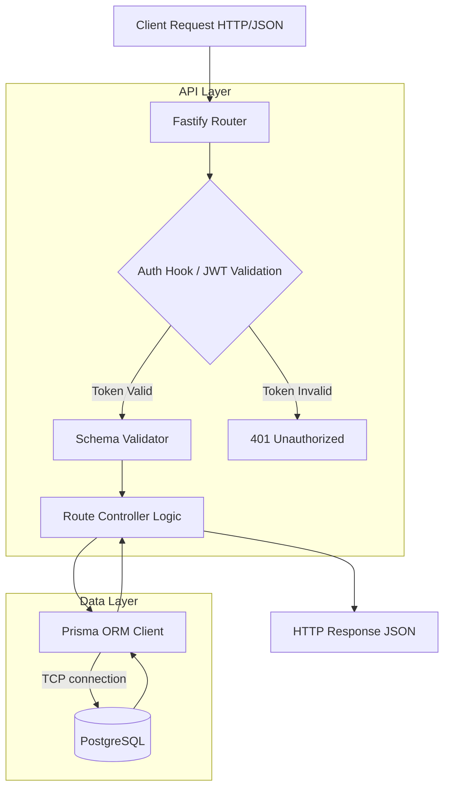
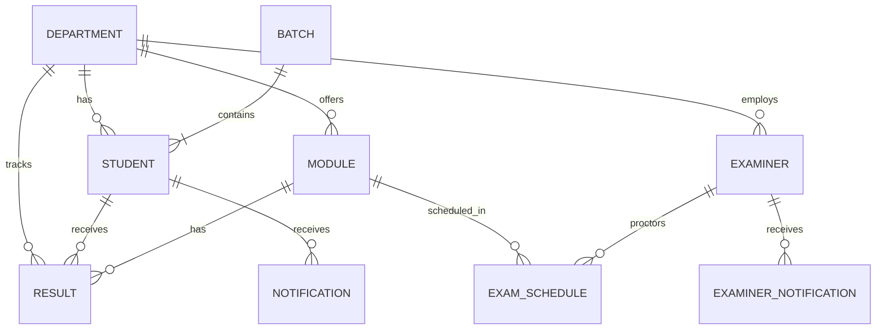

# 🎓 Results Management System - Backend Architecture & Documentation

This document provides a comprehensive overview of the backend architecture for the Results Management System (RMS). It details the database schema, API design, authentication flows, security measures, and scaling strategies.

---

## 1. Overview
The RMS backend is a stateless, high-performance RESTful JSON API built to process bulk data, handle complex GPA calculations, and serve thousands of students simultaneously. It completely abstracts database logic from the frontend clients.

## 2. Technology Stack

### Core Runtime & Framework
*   **Node.js:** The JavaScript runtime environment. Selected for its non-blocking, event-driven I/O, which is ideal for high-concurrency API servers.
*   **Fastify:** The web framework. Chosen over Express.js because it is significantly faster, provides built-in JSON schema validation, and has lower overhead.

### Database & ORM
*   **PostgreSQL:** The core relational database. Chosen for its strict ACID compliance, complex querying capabilities, and high data integrity.
*   **Neon Serverless Postgres:** Used to host the database. Allows for instant branching and automatic scaling of compute resources during high traffic periods (e.g., Result Publish Day).
*   **Prisma:** The Object-Relational Mapper (ORM). Provides strict type-safety, easy-to-read schema definitions, and automated database migrations.

### Security & Utilities
*   **bcrypt:** Used to salt and hash user passwords before storing them.
*   **@fastify/jwt:** Implements stateless JSON Web Token generation and validation.
*   **csv-parser:** Used to stream and parse large CSV files (e.g., batch student uploads, bulk result uploads) efficiently without crashing the Node.js process.

---

## 3. Architecture & Request Lifecycle

The system utilizes a standard layered API architecture:

### What Happens During a Request?
1.  **Routing:** Fastify matches the URL path and HTTP method.
2.  **Pre-Handler (Auth Hook):** If the route is protected, the server extracts the `Authorization` header and decodes the JWT using the private `JWT_SECRET`. It checks the user's role (RBAC - Role-Based Access Control).
3.  **Schema Validation:** Fastify checks the incoming request payload (Body, Params, Query) against a predefined JSON Schema. If invalid, a 400 error is thrown instantly.
4.  **Controller:** The business logic runs (e.g., calculating GPA, parsing a CSV).
5.  **Database Query:** Prisma executes the generated SQL securely against the Neon database.

---

## 4. Database Schema

The database relies heavily on relational integrity.

### Key Design Decisions
*   **Cascading Deletes:** To prevent orphaned records, deleting a `Student` will `Cascade` delete their `Results` and `Notifications`.
*   **Composite Keys:** A student can only have one result per module. The `Result` table enforces this via a composite unique key: `@@id([studentRegNo, moduleCode])`.

---

## 5. Security Implementations

*   **Stateless Authentication:** We use JWTs instead of server-side sessions. This means the API servers hold no state, allowing us to spin up multiple servers (horizontal scaling) behind a load balancer without needing "sticky sessions" or a Redis session store.
*   **Password Hashing:** Passwords are never stored in plain text. `bcrypt` adds a computational cost factor (salt rounds) to slow down brute-force attacks in the event of a database leak.
*   **SQL Injection Protection:** Because we use Prisma, all database inputs are automatically parameterized, completely eliminating standard SQL injection vectors.
*   **CORS (Cross-Origin Resource Sharing):** Fastify is configured to only accept requests from the specific frontend domains.

---

## 6. Complex Workflows

### CSV Result Upload Flow
1. Examiner uploads a `.csv` file to `/api/examiner/results/upload`.
2. `multipart-parser` receives the file.
3. Node streams the file through `csv-parser`.
4. As each row is read, it pushes the data to an array in memory.
5. Once parsed, Prisma runs a `$transaction` to `upsert` all grades into the database under `isPublished = false` (Draft Mode).

### GPA Calculation Flow
1. When an Admin clicks "Publish", the backend queries all results that changed.
2. The logic iterates through the student's module credits and grade points ($A = 4.0, B = 3.0, etc.$).
3. The formula applied is: $\text{GPA} = \frac{\sum (\text{Credits} \times \text{Grade Point})}{\sum \text{Credits}}$
4. The calculated GPA is saved back to the `Student` record.

---

## 7. System Limits & Bottlenecks

### Current Limits
1.  **Memory Exhaustion on Massive CSVs:** The current CSV upload implementation holds parsed JSON objects in RAM before executing the Prisma query. If a file contains 100,000 rows, it may exceed Node's memory limit.
2.  **Synchronous GPA Processing:** Calculating GPAs for thousands of students blocks the Fastify event loop, meaning other incoming requests (e.g., a student trying to log in) will stall until the calculation finishes.
3.  **Connection Pooling:** Under heavy load, Prisma may attempt to open more connections than PostgreSQL allows, resulting in connection timeouts.

### Future Enhancements
*   **Message Queues (BullMQ & Redis):** Move CSV parsing, GPA calculations, and Notification sending to a background worker queue. The API will respond `202 Accepted` instantly, and the background worker will process the heavy lifting without blocking the web server.
*   **Connection Pooler (PgBouncer):** Implement a connection pooler between Prisma and PostgreSQL to handle tens of thousands of simultaneous connections efficiently.
*   **Token Blacklisting:** Implement a Redis store to allow immediate revocation of compromised JWTs before their natural expiration time.
