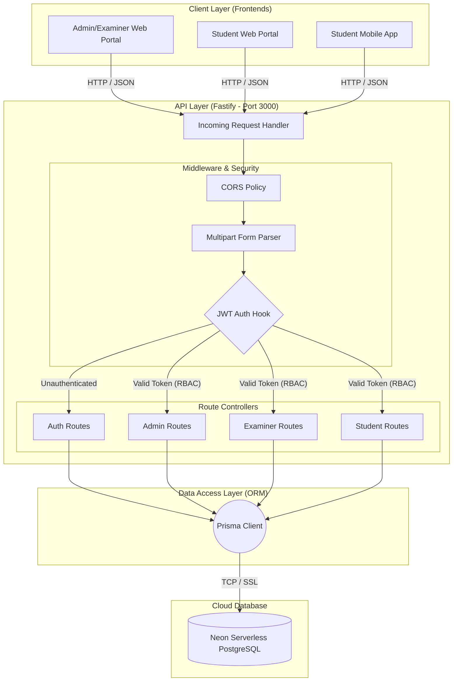
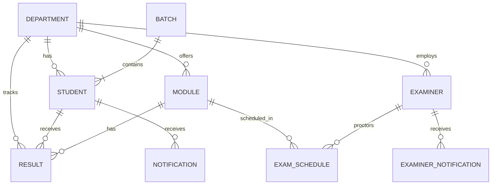
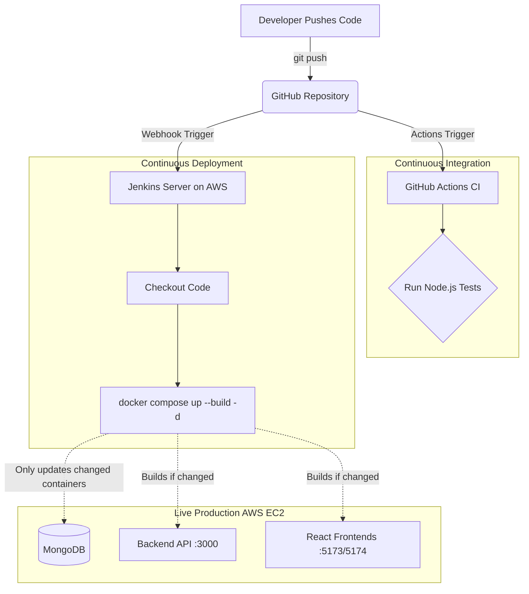
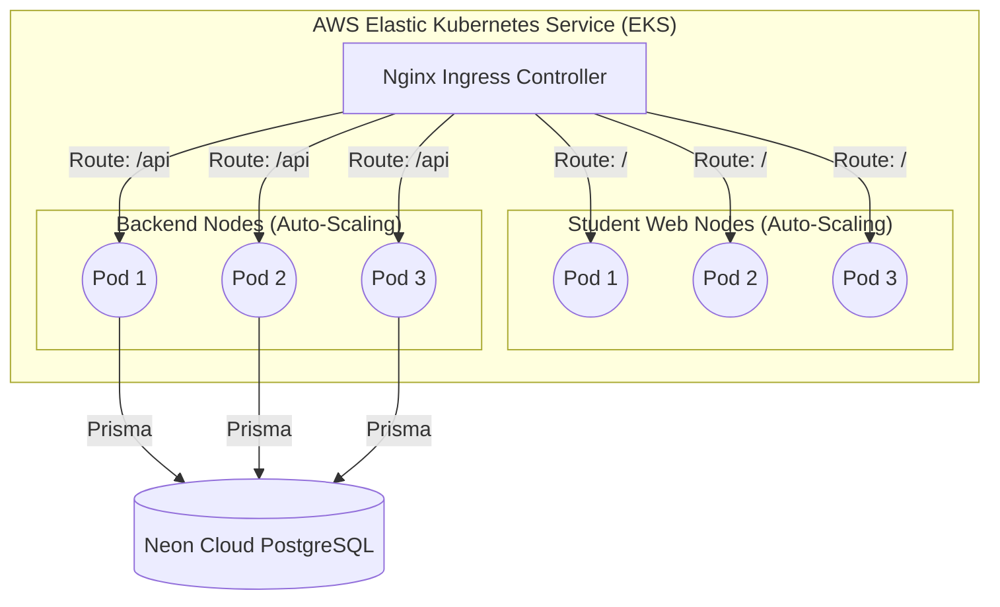

# 🎓 Results Management System - Complete Project Documentation

This comprehensive document serves as the master guide for the Results Management System (RMS). It aggregates all system designs, architecture decisions, API specs, security implementations, database schemas, and deployment strategies into a single professional resource.

---

## Table of Contents
1. [Overview](#1-overview)
2. [Technology Stack](#2-technology-stack)
3. [System Architecture](#3-system-architecture)
4. [Backend Architecture](#4-backend-architecture)
5. [Frontend Architecture](#5-frontend-architecture)
6. [Database Schema](#6-database-schema)
7. [Security Architecture](#7-security-architecture)
8. [API Documentation](#8-api-documentation)
9. [Deployment & CI/CD](#9-deployment--cicd)
10. [Kubernetes Architecture (Scaling)](#10-kubernetes-architecture-scaling)
11. [Quality Assurance & Testing](#11-quality-assurance--testing)
12. [User Flows](#12-user-flows)
13. [System Limitations & Future Improvements](#13-system-limitations--future-improvements)

---

## 1. Overview
The **Result Management System** is a full-stack web application designed to streamline the academic result processing lifecycle. It provides secure portals for Administrators/Examiners and Students, allowing bulk registration of students, module management, CSV-based result uploads, automated result processing (GPA calculations), and result publishing with real-time notifications.

---

## 2. Technology Stack

The system is built using modern, high-performance web technologies:

### **Frontend (Admin, Examiner & Student Portals)**
*   **Framework:** React 19
*   **Build Tool:** Vite
*   **Styling:** Tailwind CSS v4
*   **UI Components:** Shadcn/ui & Base UI
*   **Routing:** React Router
*   **Network/API:** Axios

### **Backend (API Server)**
*   **Runtime:** Node.js
*   **Framework:** Fastify
*   **Authentication:** JWT via `@fastify/jwt`
*   **Security:** Bcrypt (for password hashing)
*   **Data Processing:** `csv-parser` for handling bulk uploads

### **Database & ORM**
*   **Database:** PostgreSQL (Neon Serverless Postgres)
*   **ORM:** Prisma

---

## 3. System Architecture

The application follows a standard Three-Tier Client-Server Architecture.

---

## 4. Backend Architecture

The application is built on a **Modular Monolith** architecture that functions within a **Decoupled Client-Server system**. While the overall system isolates the frontend clients from the backend, the backend itself is a single monolithic Fastify Node.js application.

### Why a Modular Monolith?
- **Simplified Operations:** All API logic (Authentication, Admin operations, Examiner routes, and Student endpoints) is bundled into one Node.js process and connects to a single, shared PostgreSQL database.
- **Horizontal Scalability:** Because the monolithic backend is designed as a **Stateless JSON API** (using JWTs for session management instead of server-side state), it can effortlessly scale horizontally. Identical replicas of the backend can be spun up across multiple containers to handle traffic spikes.
- **Avoided Microservice Complexity:** We deliberately avoided microservices to bypass the operational overhead of managing distributed transactions and independent databases, which was not necessary for the application's scope.

The Fastify backend acts purely as a stateless JSON API, allowing the Mobile App and Web Apps to consume the exact same endpoints.

---

## 5. Frontend Architecture

The frontend is a Component-Based Single Page Application (SPA) designed for extremely fast rendering and a highly professional user experience. 

- **Component Library (Shadcn UI):** We utilize [Shadcn/ui](https://ui.shadcn.com/) paired with Tailwind CSS v4 to build the interface. Shadcn UI provides accessible, highly customizable, and premium-feeling components (like Data Tables, Dialogs, and Select dropdowns) that are integrated directly into the source code rather than installed as an opaque dependency. This allows us to maintain strict control over the design system.
- **State Management & Routing:** State is managed locally within components or lifted to Context where necessary. Page navigation is entirely client-side using **React Router**, ensuring instantaneous transitions between the Dashboard, Module Management, and Result pages without full-page reloads.
- **API Integration:** All HTTP communication with the Fastify backend is handled by **Axios**, using a globally configured instance that automatically attaches the `Authorization: Bearer <token>` header to protected requests.
- **Build & Tooling:** The application is bundled using **Vite**, offering near-instant Hot Module Replacement (HMR) during development and highly optimized minified bundles for production.

---

## 6. Database Schema

The core entities are highly relational, allowing complex grade tracking and department-level access control. The database is fully managed via the **Prisma ORM**.

**Schema Highlights:**
- **Composite Primary Keys:** The `Result` table uses a composite primary key (`studentRegNo` + `moduleCode`).
- **Referential Integrity:** Uses cascading deletes (`onDelete: Cascade`).

---

## 7. Security Architecture

Stateless authentication is critical for protecting student and faculty data, allowing scaling across Web and Mobile frontends without needing server-side sessions.

1. **Token Generation (Login):** Back-end uses `bcrypt` to compare the hashed password. Generates a JWT containing the user's unique ID and **Role**. Signed using private `JWT_SECRET` key.
2. **Protecting Routes:** A global authentication hook in `server.js` verifies the `Authorization: Bearer <token>`.
3. **RBAC:** Auth routes are public, but Admin, Student, and Examiner routes are strictly locked behind the JWT hook.

---

## 8. API Documentation

**Base URL:**
- **Production:** `http://54.198.25.194:3000/api`
- **Development:** `http://localhost:3000/api`

### Authentication Routes (`/auth`)
| Method | Endpoint | Description |
|---|---|---|
| `POST` | `/auth/admin/login` | Authenticate an Admin |
| `POST` | `/auth/student/login` | Authenticate a Student |
| `POST` | `/auth/examiner/login` | Authenticate an Examiner |
| `POST` | `/auth/examiner/register` | Register a new Examiner |
| `POST` | `/auth/student/change-password` | Update student password (requires JWT) |

### Administrator Routes (`/admin`) - *Requires Admin Token*
| Method | Endpoint | Description |
|---|---|---|
| `GET` | `/admin/batches` | Retrieve all student batches |
| `POST` | `/admin/batches` | Create a new batch and auto-generate accounts |
| `POST` | `/admin/modules` | Add a new academic module |
| `GET` | `/admin/students` | Retrieve a list of all students |
| `POST` | `/admin/students/upload` | Upload CSV to bulk-import students |
| `PUT` | `/admin/results/publish` | Publish verified results |

### Examiner Routes (`/examiner`) - *Requires Examiner Token*
| Method | Endpoint | Description |
|---|---|---|
| `GET` | `/examiner/modules` | Fetch assigned modules |
| `POST` | `/examiner/results/upload` | Upload CSV of student grades |
| `GET` | `/examiner/schedules` | View examination schedules |
| `GET` | `/examiner/notifications` | Fetch unread notifications |

### Student Routes (`/student`) - *Requires Student Token*
| Method | Endpoint | Description |
|---|---|---|
| `GET` | `/student/results` | Fetch published results and GPA breakdown |
| `GET` | `/student/profile` | Retrieve the student's profile information |
| `GET` | `/student/notifications` | Fetch alerts |

---

## 9. Deployment & CI/CD

The application is hosted on an **AWS EC2 Instance** using Docker Compose.

---

## 10. Kubernetes Architecture (Scaling)

While currently using Docker Compose for the MVP, the app is 100% Kubernetes-Ready for nationwide scaling using Horizontal Pod Auto-Scaling (HPA).

---

## 11. Quality Assurance & Testing

- **Security Testing:** SQLi prevention via Prisma. XSS prevention via React. JWT logic testing.
- **API & Integration Testing:** Conducted using Vitest + Supertest to assert status codes and schemas.
- **Unit Testing:** Focuses heavily on the GPA Calculation Engine and registration number logic.
- **E2E UI Testing:** Cypress/Playwright used to test Admin login/setup and Student verification.
- **UAT Checklist:** Passed authentication flows, batch management, CSV uploads, and rendering speed.

---

## 12. User Flows

### A. Admin Flow (Batch & Result Management)
1. **Create Batch:** Admin creates a new batch (RegNo Range). API generates random passwords & returns them for download.
2. **Upload Results:** Admin uploads Result CSV. API parses it and upserts results in Draft Mode.
3. **Publish:** Admin clicks "Publish". API updates `isPublished = true` and triggers student notifications.

### B. Student Flow (Viewing Results)
1. **Login:** Student logs in. If first login, prompts to change password.
2. **Dashboard:** Student views Notifications, Published Results, and Overall GPA Master Sheet.

### C. Examiner Flow (Result Uploads)
1. **Registration & Login:** Examiner signs up via the registration portal if unregistered, then logs in.
2. **Dashboard:** Examiner views assigned modules, exam schedules, and system notifications.
3. **Upload Results:** Examiner uploads a CSV file containing student grades for a specific assigned module. This stores the results in the database (Draft Mode) for Administrator verification and publishing.

---

## 13. System Limitations & Future Improvements

While the current architecture is robust and scalable for initial deployments, several limitations exist that should be addressed in future iterations to ensure enterprise-grade reliability and security:

1. **Stateless JWT Revocation:**
   - **Limitation:** The system uses stateless JSON Web Tokens (JWT) for authentication. Currently, there is no token blacklisting mechanism. If a token is compromised, it cannot be instantly revoked before its natural expiration.
   - **Improvement:** Implement a Redis-based token blacklist or use short-lived access tokens combined with long-lived refresh tokens.

2. **Single Point of Failure in Current Deployment:**
   - **Limitation:** The current production deployment uses a single AWS EC2 instance (`t3.small` / `t3.medium`) running Docker Compose. If the EC2 instance crashes or the AWS Availability Zone goes down, the entire system will be offline.
   - **Improvement:** Transition to the documented **Kubernetes (EKS)** architecture with multi-AZ deployments and Horizontal Pod Auto-Scaling (HPA) to ensure high availability.

3. **Memory Limits during Bulk CSV Parsing:**
   - **Limitation:** Although `csv-parser` streams the data to be memory-efficient, processing massive CSV files (e.g., thousands of results) on a 2GB RAM EC2 instance could potentially cause memory spikes or CPU bottlenecking, blocking the Fastify event loop.
   - **Improvement:** Offload heavy CSV processing and GPA calculations to a background worker queue (e.g., BullMQ with Redis) instead of processing them synchronously in the main API thread.

4. **Missing Production Security Hardening:**
   - **Limitation:** Important security headers and rate limiting are identified in the QA documentation but have not yet been fully enforced. This leaves the API susceptible to automated brute-force attacks on the `/api/auth/login` endpoints.
   - **Improvement:** Integrate `@fastify/rate-limit` for endpoint protection and `@fastify/helmet` to enforce strict HTTP security headers against XSS, clickjacking, and sniffing.

5. **Database Connection Pooling Limits:**
   - **Limitation:** The system relies on Neon Serverless PostgreSQL. Under sudden massive traffic spikes (e.g., on Result Publication Day), Prisma might exhaust the database connection pool if auto-scaling isn't tuned correctly.
   - **Improvement:** Utilize an external connection pooler like PgBouncer or Prisma Accelerate to efficiently manage database connections under extreme load.
