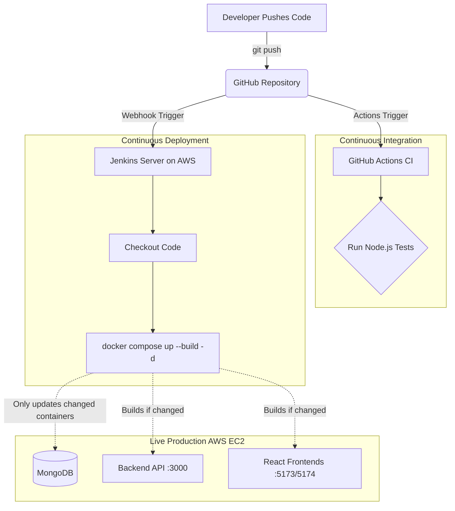

# Results Management System - Deployment Documentation

This document outlines the complete CI/CD architecture and deployment process for the Results Management System (RMS) MERN Stack application. 

## System Architecture




## 1. Cloud Infrastructure (AWS EC2)
The application is hosted on an **Amazon Web Services (AWS) EC2 Instance**.
- **Instance Type:** `t3.small` / `t3.medium` (Minimum 2GB RAM required for building React applications).
- **Operating System:** Ubuntu Server 24.04 LTS
- **Public IP:** `54.198.25.194`
- **Security Groups (Open Ports):**
  - `22`: SSH Access
  - `8080`: Jenkins Dashboard
  - `3000`: Backend API (Fastify)
  - `5173`: Main Admin Frontend (React)
  - `5174`: Student Frontend (React)

## 2. Server Prerequisites
The following software was installed on the EC2 server to run the deployment pipeline:
1. **Docker & Docker Compose:** Used to containerize the MERN stack (MongoDB, Backend, 2 Frontends).
2. **Java 17:** Required to run Jenkins.
3. **Jenkins:** The automation server handling the Continuous Deployment (CD).

*Note: Jenkins was added to the `docker` user group (`sudo usermod -aG docker jenkins`) to allow the pipeline to run Docker commands without requiring `sudo` privileges.*

## 3. Continuous Deployment (CD) - Jenkins
We utilized Jenkins for Continuous Deployment. 

### Pipeline Architecture
A `Jenkinsfile` is located in the root of the repository. It defines a declarative pipeline with the following stages:
1. **Checkout Code:** Pulls the latest code from the `main` branch on GitHub.
2. **Build & Deploy:** Executes `docker compose up --build -d` to automatically rebuild any updated containers and deploy them live with minimal downtime.

### Automation Trigger
To make the deployment entirely automatic, we configured a **GitHub Webhook**. 
- **Webhook Configuration:** Configured in the GitHub Repository settings to point to the Jenkins server endpoint (`/github-webhook/`).
- **Result:** Any time a developer pushes code to the `main` branch, GitHub sends an instant push notification to Jenkins, which instantly triggers the CD pipeline to deploy the new code.

## 4. Continuous Integration (CI) - GitHub Actions
We utilized **GitHub Actions** for Continuous Integration (Automated Testing).
- **Workflow File:** `.github/workflows/ci.yml`
- **Trigger:** Runs automatically on any `push` or `pull_request` to the `main` branch.
- **Process:** It sets up Node.js 20.x, installs backend dependencies (`npm install`), and runs the test suite (`vitest run`).
- **Database Mocking:** Since GitHub Actions does not have access to the real production `.env` file, a dummy `DATABASE_URL` is injected into the test environment so Prisma can boot successfully during validation testing.

## 5. Frontend Network Configuration
To connect the frontend React applications to the live backend server without hardcoding IPs in every file, we utilized a global Axios configuration.

In both `frontend/src/main.jsx` and `student-frontend/src/main.jsx`, we defined:
```javascript
import axios from 'axios';
axios.defaults.baseURL = 'http://54.198.25.194:3000';
```
This ensures all API requests route properly to the AWS EC2 instance, allowing the React UI components to use clean, relative paths (e.g., `axios.get('/api/admin/...')`).

## 6. Zero-Downtime Rebuilds
Because the application is deployed via `docker-compose`, Docker intelligently handles partial updates. If a push only modifies the frontend code, Docker Compose will only rebuild the frontend image and replace the container. The backend API and database will remain untouched and online, providing a nearly zero-downtime deployment experience.
