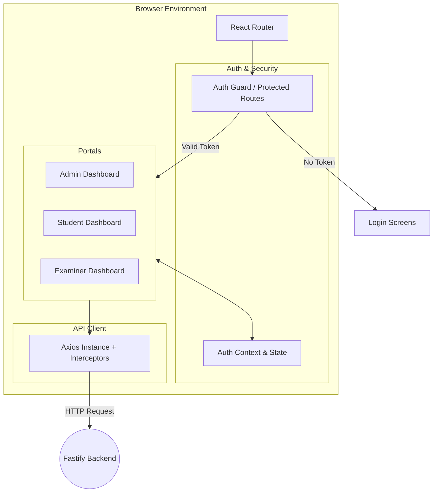

# 🎓 Results Management System - Frontend Architecture & Documentation

This document provides a comprehensive overview of the frontend architecture for the Results Management System (RMS). It covers the technologies used, architectural decisions, routing, state management, and UI design principles.

---

## 1. Overview
The RMS frontend is a modern Single Page Application (SPA) divided into distinct portals for Students, Administrators, and Examiners. It aims to provide an incredibly fast, secure, and professional user interface for managing academic results, viewing GPA metrics, and receiving notifications.

## 2. Technology Stack

### Core Frameworks & Tooling
*   **React 19:** The core library for building the user interface. We use React 19 for its latest features (Actions, Transitions, useActionState, useOptimistic) and performance improvements.
*   **Vite:** The build tool and development server. Chosen over Webpack/CRA because of its near-instant Hot Module Replacement (HMR) and highly optimized ESBuild integration, significantly speeding up development time.
*   **React Router:** Used for client-side routing. Allows instantaneous page transitions without full page reloads, providing a seamless application feel.

### Styling & UI Design System
*   **Tailwind CSS v4:** A utility-first CSS framework. V4 was chosen for its massive performance improvements, zero-configuration engine, and native CSS variable integration.
*   **Shadcn/ui & Base UI:** Used for accessible, unstyled UI component primitives. Instead of an opaque library like Material UI, Shadcn injects components directly into the source code, giving us 100% control over the design system.
*   **Fonts:** `@fontsource-variable/geist` is used as the primary typography to deliver a clean, modern aesthetic.
*   **Animations:** `tw-animate-css` is integrated to provide subtle, professional micro-animations (e.g., fades, slides) that enhance user experience.

### Network & State
*   **Axios:** Handles all HTTP communication with the backend API. It is configured globally to inject authentication tokens via interceptors.
*   **Local State Management:** Handled natively via React Hooks (`useState`, `useReducer`, Context API).

---

## 3. Architecture & Request Flow

The frontend follows a Component-Based Architecture with distinct layers for routing, API communication, and UI rendering.



### Why This Architecture?
*   **Separation of Concerns:** Routing logic is isolated from UI components. API calls are centralized in service files.
*   **Security Context:** The Auth Guard strictly checks token validity before rendering any protected routes. If a user is not authenticated, they are immediately redirected.

---

## 4. Styling & Theme System

We use a custom-defined CSS variable system integrated deeply with Tailwind CSS v4.

**Example from `index.css`:**
```css
@theme {
  --color-brand-900: #611010;
  --color-brand-800: #611110;
  --color-brand-700: #6b2020;
  --color-brand-gold: #f5bd1a;
  --color-brand-white: #fefefe;
}
```
### Design Principles
*   **Vibrant & Professional:** The deep red/maroon (`#611010`) mixed with gold (`#f5bd1a`) provides an academic, premium feel.
*   **Dark Mode Support:** The `@custom-variant dark (&:is(.dark *));` allows seamless toggling into dark mode.
*   **Responsiveness:** Mobile-first design principles ensure the application looks perfect on desktop monitors, tablets, and mobile devices.

---

## 5. Security & Data Flow

1.  **Authentication Flow:**
    *   User submits credentials.
    *   Axios POST request is sent to `/api/auth/login`.
    *   Backend returns a stateless **JWT (JSON Web Token)**.
    *   Token is saved in `localStorage` or `sessionStorage`.
    *   Auth Context is updated, re-rendering the app to allow entry past the Auth Guard.

2.  **API Interceptors:**
    *   An Axios Interceptor automatically attaches `Authorization: Bearer <token>` to all outbound requests.
    *   If a `401 Unauthorized` response is received, the interceptor automatically clears the token and redirects the user to the Login page.

---

## 6. System Limits & Future Enhancements

### Current Limits
*   **Large Data Rendering:** Rendering thousands of rows for the Admin results view simultaneously can cause DOM bloat and stuttering.
*   **Bundle Size:** As more third-party packages are added, the initial JavaScript payload size increases.

### Future Enhancements
*   **Virtualization:** Implement `react-window` or `@tanstack/react-virtual` for data tables to efficiently render large datasets without DOM lag.
*   **Code Splitting:** Implement aggressive route-based code splitting (`React.lazy()`) to ensure users only download the Javascript necessary for their specific portal (e.g., a student never downloads the admin logic).
*   **Offline Support:** Integrate Service Workers and a PWA (Progressive Web App) manifest to allow students to view cached results when offline.
