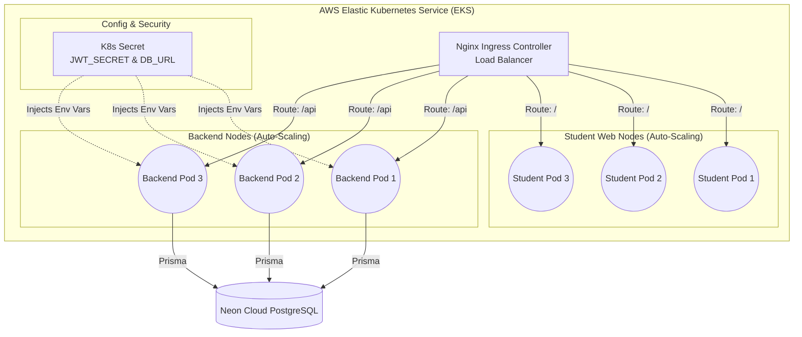

# ☸️ Kubernetes (K8s) Migration Architecture

Right now, the application runs on a single AWS EC2 instance using **Docker Compose**. While this is excellent for current needs, migrating to **Kubernetes (K8s)** would allow the system to handle millions of students with zero downtime, auto-scaling, and self-healing.

If you are asked during your presentation *"How would you scale this for the entire country?"*, here is exactly how you would explain the Kubernetes migration:

## 1. How Our Containers Map to Kubernetes

In Kubernetes, we would stop using a single `docker-compose.yml` file and break our system into enterprise components:

| Current (Docker Compose) | Kubernetes Equivalent | Purpose |
|---|---|---|
| `backend` container | **Deployment** (3 Replicas) | We would run 3 copies (Pods) of the Node.js backend simultaneously. If one crashes, K8s instantly spins up a new one (Self-Healing). |
| `admin-frontend` container | **Deployment** (2 Replicas) | High-availability React frontend for admins. |
| `student-frontend` container | **Deployment** (5 Replicas) | High-availability React frontend for students (scaled higher because there are more students than admins). |
| Ports (e.g., `3000:3000`) | **ClusterIP Service** | Provides a stable internal IP address for the backend so the frontends can always find it, even if Pods restart. |
| AWS Public IP (`54.198...`) | **Ingress Controller** | Acts as an intelligent router. If a user visits `/api`, it routes to the backend. If they visit `/admin`, it routes to the Admin frontend. |
| `.env` files | **ConfigMaps & Secrets** | `JWT_SECRET` and `DATABASE_URL` would be stored securely in a Kubernetes Secret, injected into the Pods at runtime. |

---

## 2. Horizontal Pod Auto-Scaling (HPA)

The biggest advantage of Kubernetes for the RMS system is **HPA**. 
During the semester, traffic is low. But on **Results Publication Day**, traffic spikes massively. 

With Kubernetes HPA, we would set a rule: 
> *If the Backend CPU usage goes over 70%, automatically create 10 more backend Pods to handle the traffic. When the traffic drops, destroy them to save AWS server costs.*

---

## 3. Kubernetes Architecture Diagram

## 4. Why We Used Docker Compose Instead for the MVP
If professors ask why you used Docker Compose instead of Kubernetes for this project:
*"Kubernetes is incredibly powerful, but it requires at least a cluster of 3 VMs (Master and Worker nodes) which is expensive and overkill for our initial Faculty-level deployment. Docker Compose gave us 90% of the benefits (containerization, isolation, and portability) at 10% of the infrastructure cost. However, because our app is fully Dockerized and Stateless (JWT), it is **100% Kubernetes-Ready** whenever the university wants to scale it nationwide."*
