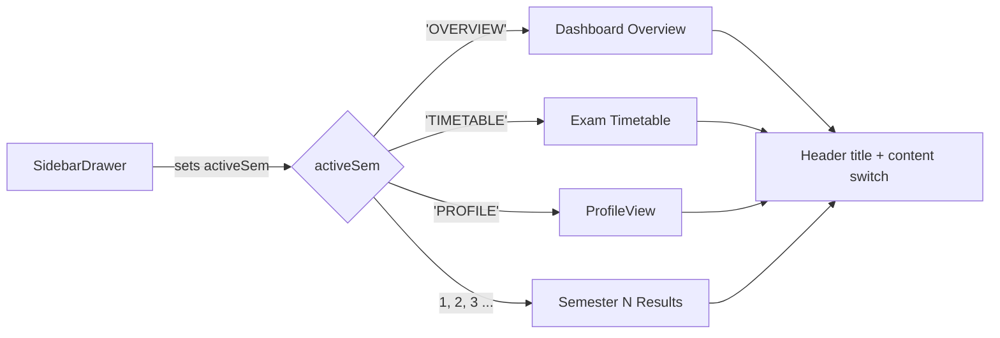

# 🎓 Results Management System - Mobile App Architecture & Documentation

This document provides a comprehensive overview of the Student Mobile Application architecture for the Results Management System (RMS). It covers the technologies used, architectural decisions, routing, state management, and API integrations.

---

## 1. Overview
The RMS Mobile Application is a companion app designed exclusively for Students. It allows them to view their dashboard, check exam schedules, monitor their results/GPA, and receive real-time notifications directly from their mobile devices. It is built as a cross-platform application (iOS & Android) to ensure maximum accessibility.

## 2. Technology Stack

### Core Frameworks & Tooling
*   **React Native (0.86):** The core framework for building native cross-platform mobile apps using React principles.
*   **Expo (~57):** The framework and platform built around React Native. Chosen for its streamlined development experience, managed build process (EAS), and built-in modules (Splash Screen, Fonts, Status Bar).
*   **React Navigation v7:** Used for native app routing. Specifically, `@react-navigation/native` and `@react-navigation/native-stack` are utilized to manage the screen stack and transitions seamlessly.
*   **EAS Build (cloud native builds):** Produces installable artefacts without a local Android SDK / Xcode. The `preview` profile in `eas.json` sets `android.buildType: "apk"` so the output is a directly installable APK rather than an `.aab`.
*   **Continuous Native Generation (CNG):** `android/` and `ios/` are *not* committed. They are generated on demand by `expo prebuild`, so every piece of native behaviour is declared through `app.json` and config plugins instead of hand-edited Gradle/manifest files.
*   **Config Plugins:** `expo-font` (bundles Geist), `expo-splash-screen` (branded splash), `expo-build-properties` (sets `usesCleartextTraffic` for the HTTP backend).

### Styling & UI Design System
*   **Custom Theme (`src/theme.js`):** A centralized styling theme reflecting the brand's colors (`brand900`, `brandGold`, `brandWhite`).
*   **Safe Area Context:** `react-native-safe-area-context` ensures the UI avoids notches, status bars, and home indicators on modern edge-to-edge screens.
*   **Fonts:** The same `Geist-Variable` font used in the web portal is loaded via `expo-font` to ensure a consistent, premium brand identity across all platforms.
*   **Icons:** `lucide-react-native` provides clean, modern SVG icons that match the Shadcn/ui icons used on the web.
*   **Reusable Brand Components:** `BrandButton`, `BrandInput`, `Badge`, `Card`, `SidebarDrawer` and `ProfileView` form the shared visual vocabulary. `BrandInput` accepts an optional `showSecureToggle` prop that renders an `Eye` / `EyeOff` pressable for password reveal, mirroring the web portal's input behaviour.

### Network & State
*   **Axios:** Handles all HTTP communication with the Fastify backend API.
*   **AsyncStorage:** `@react-native-async-storage/async-storage` securely stores the JWT (JSON Web Token) persistently across app restarts.
*   **Environment Configuration:** `.env` supplies `EXPO_PUBLIC_API_URL`, which is **inlined into the JS bundle at build time**. In Expo Go / development, `src/config.js` falls back to deriving the base URL from Expo's Metro host so the app reaches a dev backend on the same LAN with no code changes.
*   **Shared Error Normalisation:** `apiErrorMessage(err, fallback)` in `src/api.js` surfaces the backend's `error` field when present, and produces a "Cannot reach the server at {API_BASE_URL}…" message when there is no HTTP response at all, so transport failures are never misreported as bad credentials.

---

## 3. Architecture & Request Flow

The mobile app follows a Component-Based Architecture tailored for native environments.

```mermaid
graph TD
    subgraph Mobile App (Expo / React Native)
        NAV[React Navigation Stack]
        
        subgraph Screens
            A[LoginScreen]
            B[ChangePasswordScreen]
            C[DashboardScreen]
        end
        
        subgraph Storage & Security
            STORAGE[(AsyncStorage)]
        end
        
        subgraph API Client
            AXIOS[Axios Instance + Interceptors]
        end
    end
    
    NAV --> Screens
    A --> |Save JWT| STORAGE
    C <--> |Read JWT| STORAGE
    Screens --> AXIOS
    AXIOS --> |HTTP Request| BACKEND((Fastify API Layer))
```

### Why This Architecture?
*   **Stateless Scaling:** By relying on JWTs stored locally rather than session cookies, the mobile app interacts with the exact same Fastify API as the Web Portals, ensuring DRY (Don't Repeat Yourself) backend logic.
*   **Native Feel:** Using `Native Stack` navigation means the app uses the underlying native navigation primitives (like UIViewController on iOS), making transitions feel hardware-accelerated and smooth.

### Navigation Stack vs. Dashboard View Modes

Only three routes exist in the native stack (`Login` → `ChangePassword` → `Dashboard`). Everything inside the dashboard is **not** a route — it is local state on `DashboardScreen`, driven by a single `activeSem` value:



*   `activeSem` holds `'OVERVIEW'`, `'TIMETABLE'`, `'PROFILE'` or a semester number. The header title and the rendered body are both derived from it.
*   The `SidebarDrawer` is a modal that replicates the web sidebar (nav items plus a footer with Profile and Logout) and simply sets `activeSem`.
*   Data refetches never clobber an explicit selection: `setActiveSem((prev) => prev ? prev : sems[0] ?? null)`. This keeps the user inside Profile/Overview across refetches and also handles students who have zero published semesters.
*   Adding a dashboard feature means adding a view mode, not a navigator screen — so the back button keeps its native meaning (exit the app) rather than walking through dashboard tabs.

---

## 4. Security & Data Flow

1.  **Authentication Flow:**
    *   Student submits `RegNo` and `Password` on the `LoginScreen`.
    *   Axios POSTs to `/api/auth/student/login`.
    *   Upon success, the Fastify backend returns a JWT.
    *   The JWT is immediately saved into `AsyncStorage` using the key `studentToken`.
    *   If it is the student's first login (indicated by the backend), they are routed to `ChangePasswordScreen`. Otherwise, they proceed to `DashboardScreen`.

2.  **API Interceptors (`src/api.js`):**
    *   Before any request leaves the phone, an Axios Request Interceptor asynchronously retrieves the token from `AsyncStorage`.
    *   It automatically attaches the `Authorization: Bearer <token>` header.
    *   A custom error handler gracefully manages network transport failures (e.g., when the phone drops Wi-Fi or cannot reach the backend IP) without faking bad credentials.

3.  **Profile & Password Management Flow (post-login, added 2026-10-08):**
    *   `ProfileView` loads the student's identity from `GET /api/student/profile` → `{ regNo, department, batch, notificationsEnabled }`.
    *   A voluntary password change posts `{ newPassword, currentPassword }` to `/api/auth/student/change-password`. `currentPassword` is only omitted on the forced first-login path — afterwards the backend requires it, and `authApi.changePassword(newPassword, currentPassword)` spreads it in conditionally.
    *   The endpoint returns a **freshly issued JWT**, which immediately overwrites `studentToken` in `AsyncStorage`. Without this re-save the next request would be signed with an invalidated token.
    *   Client-side validation runs first: mismatched confirm field → "New password and confirm password do not match!"; shorter than 6 characters → "Password must be at least 6 characters long.". The submit button stays disabled until all three fields are filled.
    *   The notification preference is a separate, independent write: `PUT /api/student/notification-settings` with `{ enabled }` → `{ success, notificationsEnabled }`. Toggling it on triggers a notification refetch; toggling it off clears the in-memory list.

4.  **Cleartext HTTP:** The deployed backend is served over plain HTTP on an EC2 host. Android 9+ blocks cleartext traffic by default, so `expo-build-properties` sets `android.usesCleartextTraffic = true` in the generated manifest. This is a deliberate, documented exception — moving the API behind TLS would let it be removed.

---

## 5. Key Screens & Features

*   **LoginScreen:** The entry point. Handles credentials and initial backend ping.
*   **ChangePasswordScreen:** A forced security flow for first-time logins to ensure students do not use the auto-generated batch passwords indefinitely.
*   **DashboardScreen:** The central hub pulling aggregated data from multiple endpoints:
    *   `studentApi.dashboard()`: Fetches GPA, module results, and profile info.
    *   `studentApi.examSchedules()`: Fetches upcoming exam dates and locations.
    *   `studentApi.notifications()`: Fetches system alerts and grade publish notices.
    *   `studentApi.markNotificationsRead()`: Marks notifications as read from the bell modal.
    *   Data is refetched on screen focus (`useFocusEffect`), and an explicit `activeSem` selection survives those refetches.
*   **ProfileView (`src/components/ProfileView.js`)** *(added 2026-10-08)*: The React Native counterpart of `student-frontend/src/pages/student/ProfileView.jsx`, opened from the sidebar footer as the `activeSem === 'PROFILE'` dashboard mode. It is composed of three `SectionCard`s (a `Card` wrapping a separate, non-elevated clip layer — combining `overflow: 'hidden'` with `elevation` on the same view hides all children on some Android devices):
    *   **Student Details** (`User` icon) — Registration Number, Department, Batch; shows "Loading profile…" until `studentApi.profile()` resolves.
    *   **Change Password** (`Lock` icon) — current / new / confirm, all three using `BrandInput` with `secureTextEntry` + `showSecureToggle` eye icons; calls `authApi.changePassword(newPassword, currentPassword)` and persists the returned JWT.
    *   **Notification Settings** (`Bell` / `BellOff` icon) — a native `Switch` ("Enable result notifications" / "Get notified in the portal when new results are released.") bound to `studentApi.updateNotificationSettings(enabled)`, disabled until the profile has loaded. It reports changes upward through `onNotificationSettingChange` so the dashboard's notification list stays in sync.

---

## 6. System Limits & Future Enhancements

### Current Limits
*   **Token Security:** `AsyncStorage` stores data in plain text on the device. While standard apps do this, it is technically accessible if a device is deeply compromised or jailbroken.
*   **Offline Mode:** Currently, the app requires an active network connection to display the dashboard. If the network drops, API calls fail.

### Future Enhancements
*   **Secure Storage:** Migrate from `AsyncStorage` to `expo-secure-store` to encrypt the JWT using the device's native Keystore (Android) or Keychain (iOS).
*   **Offline Caching:** Implement a local SQLite database or sophisticated caching layer so students can view their downloaded results and exam schedules even when offline.
*   **Push Notifications:** Integrate Expo Push Notifications or Firebase Cloud Messaging (FCM) to actively wake up the device when grades are published, rather than relying on the student opening the app to poll for notifications.
*   **HTTPS Backend:** Serve the API over TLS so `usesCleartextTraffic` can be removed from the Android manifest.
*   **Artefact Hosting:** EAS build artefact URLs expire roughly two weeks after a build. Use `eas submit` / release storage (or re-run the build) when a durable download link is needed for distribution.

### Resolved Since This Document Was First Written
*   ✅ **Branded icon & splash** — the Expo defaults are gone. `app.json` now declares a maroon adaptive icon (foreground/background/monochrome layers) and an `expo-splash-screen` config with `image`, `imageWidth: 200` and `resizeMode: "contain"`. Supplying the image is what makes `expo prebuild` emit `splashscreen_logo` at all five densities; without it the Android build fails at the Gradle resource-linking step with `resource drawable/splashscreen_logo not found`.
*   ✅ **Standalone installable app** — a real APK is now produced through EAS cloud builds and installed on a physical device (see §7). Expo Go and a shared Wi-Fi network are no longer required.
*   ✅ **Feature parity with the web portal** — the Profile section (student details, self-service password change, notification preference) and the password reveal toggles now exist on mobile too.

---

## 7. Build & Distribution (EAS)

### Configuration

| File | Purpose |
|---|---|
| `eas.json` | Build profiles. `cli.appVersionSource: "local"` keeps `app.json` as the single source of truth for `version` / `versionCode`. |
| `app.json` | Android identity (`package: com.ruhuna.engrms.student`, `versionCode: 1`), adaptive icon, splash screen, `expo-build-properties`, and `extra.eas.projectId`. |
| `.env` | `EXPO_PUBLIC_API_URL` — the backend base URL baked into the bundle. |

`eas.json` profiles:

*   **`development`** — `developmentClient: true`, `distribution: "internal"`. For local debugging against Metro.
*   **`preview`** — `distribution: "internal"` with `android.buildType: "apk"`. This is the one that yields a directly installable APK; it is the profile used for on-device distribution to the team.
*   **`production`** — `autoIncrement: true`, default `.aab` output. Intended for store submission.

### Producing an APK

```bash
cd student-mobile
npx eas-cli@latest login                                   # interactive, once
npx eas-cli@latest build --platform android --profile preview
npx eas-cli@latest build:view <build-id>                   # status + artefact URL
```

`extra.eas.projectId` is already present in `app.json`, so the CLI does not prompt for `eas init` and non-interactive commands (`build:list`, `build:view --json`) work.

### Verified Build Record (2026-10-08)

| Field | Value |
|---|---|
| Build ID | `1472878e-2771-4e9e-beec-2fbcc72a7fd6` |
| Profile | `preview` (`buildType: apk`) |
| Application ID | `com.ruhuna.engrms.student` |
| Version | `1.0.0` (versionCode `1`) |
| Status | **FINISHED** — no errors |
| Duration | 830,832 ms (~14 minutes) |
| Artefact | `https://expo.dev/artifacts/eas/tkzy1AEGLHdrFL8eOR1k11hVspw3T5q-JUrRy_wbI7s.apk` (expires ~2026-10-22) |
| Backend baked in | `http://54.198.25.194:3000` (AWS EC2) |

### Pre-flight Checks (do these locally — each cloud build costs one credit)

```bash
npx expo-doctor                                        # dependency/config health: 18/18 passing
./node_modules/.bin/expo export --platform android     # JS bundle compiles (2845 modules)
./node_modules/.bin/expo prebuild --platform android --no-install   # native project generates
```

Two gotchas learned the hard way:

1.  **`.env` must stay tracked in git.** EAS respects `.gitignore` when it archives the project for upload. If `.env` is ignored, the build succeeds but ships an APK whose `EXPO_PUBLIC_API_URL` fell back to `http://localhost:3000` — every request then fails on the phone with no obvious cause. Confirm by grepping the exported `.hbc` for the backend URL.
2.  **`expo prebuild` rewrites the npm scripts.** It replaces `android` / `ios` with `expo run:android` / `expo run:ios`, which breaks the Expo Go workflow. Restore them to `expo start --android` / `expo start --ios` after running prebuild locally.
