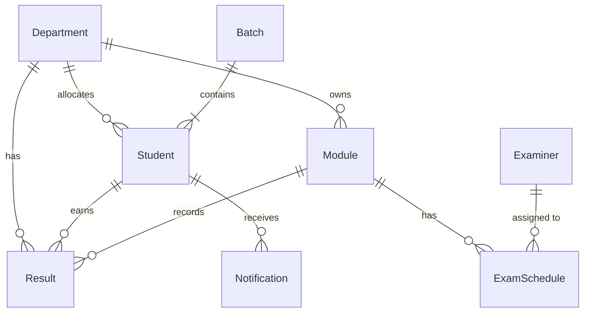
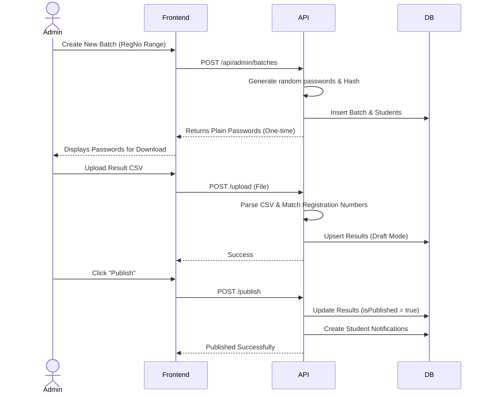
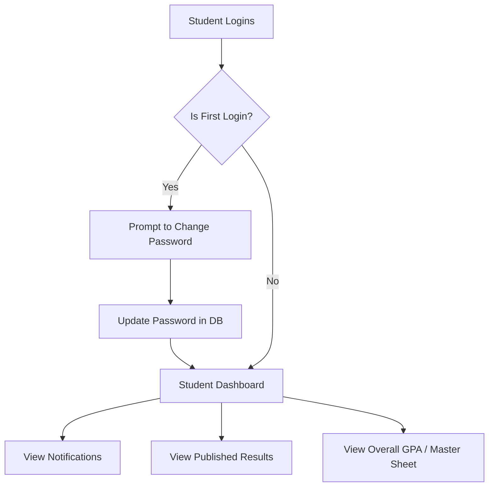
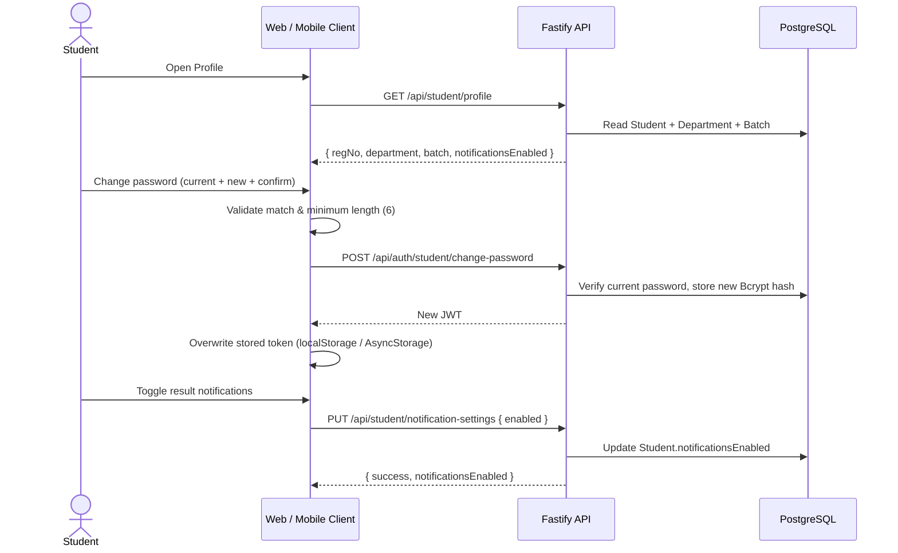

# Result Management System Documentation

## 1. Overview
The **Result Management System** is a full-stack web application designed to streamline the academic result processing lifecycle. It provides secure portals for Administrators/Examiners and Students, allowing bulk registration of students, module management, CSV-based result uploads, automated result processing (GPA calculations), and result publishing with real-time notifications.

---

## 2. Technology Stack & Frameworks

The system is built using modern, high-performance web technologies:

### **Frontend (Admin & Student Portals)**
*   **Framework:** [React 19](https://react.dev/) – Component-based UI library.
*   **Build Tool:** [Vite](https://vitejs.dev/) – Next-generation, blazing-fast frontend tooling.
*   **Styling:** [Tailwind CSS v4](https://tailwindcss.com/) – Utility-first CSS framework for rapid UI development.
*   **UI Components:** [Shadcn/ui](https://ui.shadcn.com/) & [Base UI] – Accessible, customizable UI components.
*   **Routing:** [React Router](https://reactrouter.com/) – Client-side routing.
*   **Network/API:** [Axios](https://axios-http.com/) – Promise-based HTTP client for API requests.
*   **Icons:** Lucide React.

### **Backend (API Server)**
*   **Runtime:** [Node.js](https://nodejs.org/)
*   **Framework:** [Fastify](https://fastify.dev/) – Extremely fast and low-overhead web framework for Node.js (significantly faster than Express).
*   **Authentication:** JWT (JSON Web Tokens) via `@fastify/jwt`.
*   **Security:** Bcrypt (for password hashing).
*   **Data Processing:** `csv-parser` for handling bulk uploads (results, department allocations).

### **Database & ORM**
*   **Database:** [PostgreSQL](https://www.postgresql.org/) (Hosted via Neon Serverless Postgres).
*   **ORM:** [Prisma](https://www.prisma.io/) – Type-safe database client and migration tool.

### **Mobile (Student App)**
*   **Framework:** [React Native 0.86](https://reactnative.dev/) via [Expo SDK 57](https://docs.expo.dev/) — one codebase for Android and iOS.
*   **Routing:** React Navigation v7 (`native-stack`).
*   **Network:** Axios — the *same* Fastify API and JWT contract as the web portals; no mobile-specific backend was added.
*   **Storage:** AsyncStorage for the JWT (key `studentToken`, matching the web portal's `localStorage` key).
*   **Styling:** The identical brand palette, `Geist-Variable` font and Lucide icon set as the student web portal, so the two clients are visually interchangeable.
*   **Distribution:** EAS Build (cloud). The `preview` profile emits an installable **APK**; `production` emits a store-ready `.aab`. See `MOBILE_APP_DOCUMENTATION.md`.

---

## 3. System Architecture

The application follows a standard Three-Tier Client-Server Architecture.

> **Third client (added):** the diagram above predates the **Student Mobile App** (`student-mobile/`). It is an Expo/React Native client that talks to the *same* `fastify` service over the identical JWT-based HTTP contract — there is no mobile-specific API surface. The two student clients are interchangeable from the backend's point of view. Deployed builds point the mobile app at the EC2-hosted API (`http://54.198.25.194:3000`); during development it auto-derives the address from the Metro host.

---

## 4. Database Schema Structure

The core entities are highly relational, allowing complex grade tracking and department-level access control.

---

## 5. User Flows

### A. Admin Flow (Batch & Result Management)
Administrators create batches, allocate students to departments, upload CSV results, and publish them.

### B. Student Flow (Viewing Results)
Students log in to see their specific results, GPA calculations, and notifications.

### C. Student Profile & Self-Service Flow (web + mobile)

The same three endpoints back the Profile section of the student web portal and its mobile counterpart, so the flow is identical on both clients.

Key points:

*   `currentPassword` is required for a voluntary change; it is only omitted on the **forced first-login** path, where the backend has just validated the auto-generated batch password.
*   The password change issues a **fresh JWT**, and the client must persist it immediately — otherwise subsequent requests carry a stale token.
*   The notification preference is stored per-student in the database, so it applies across devices and clients rather than being a local app setting.

---

## 6. Key Implementation Details

1.  **Fast Bulk Operations:** Batch creation heavily utilizes optimized password hashing (tuned salt rounds) and Prisma's `createMany` (with `skipDuplicates`) to handle thousands of rows efficiently without blocking the event loop.
2.  **Streaming CSV Parsing:** Results and department allocations are processed using Node.js Streams piping directly into `csv-parser`. This ensures memory efficiency even with very large CSV files.
3.  **GPA Calculation Engine:** The backend dynamically calculates SGPA (Semester Grade Point Average) and CGPA (Cumulative Grade Point Average) by fetching all past results and mapping them to a standardized 4.0 grading scale logic in the Master Sheet API.
4.  **Security:** 
    *   CORS protection.
    *   Passwords are never stored in plain text (Bcrypt).
    *   Stateless JWT authentication requiring Bearer tokens on all protected routes.
5.  **Single API, Three Clients:** The admin/examiner portal, the student web portal and the student mobile app all consume one Fastify API with one JWT contract. New student-facing features are therefore implemented once on the backend and mirrored in each client — for example, the Profile section (student details, self-service password change, notification preference) required no backend work at all because `GET /api/student/profile`, `POST /api/auth/student/change-password` and `PUT /api/student/notification-settings` already existed.
6.  **Mobile Native Configuration by Declaration:** The mobile app uses Continuous Native Generation — `android/` and `ios/` are never committed but generated by `expo prebuild` from `app.json` and config plugins. Native requirements are therefore declarative and reviewable in JSON: the app identity (`com.ruhuna.engrms.student`), the branded adaptive icon and splash screen, and `usesCleartextTraffic` (needed because the EC2 backend is plain HTTP, which Android 9+ blocks by default).
7.  **Build-Time Environment Injection:** `EXPO_PUBLIC_API_URL` is inlined into the mobile JS bundle when the app is built, not read at runtime. This means the backend address is fixed per artefact — changing it requires a rebuild — and that the `.env` file must be present in the archive uploaded to EAS (it is deliberately kept tracked in git, since EAS honours `.gitignore`).
