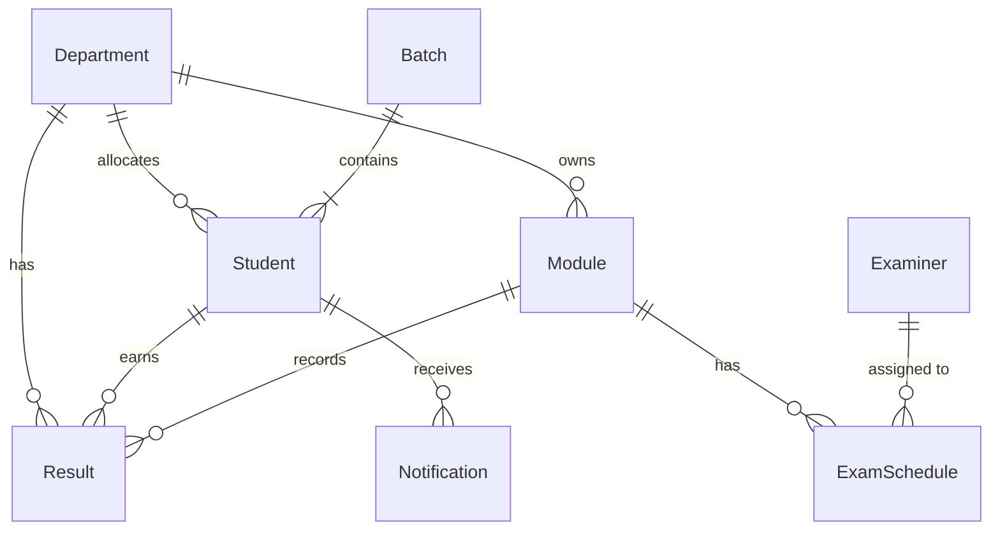
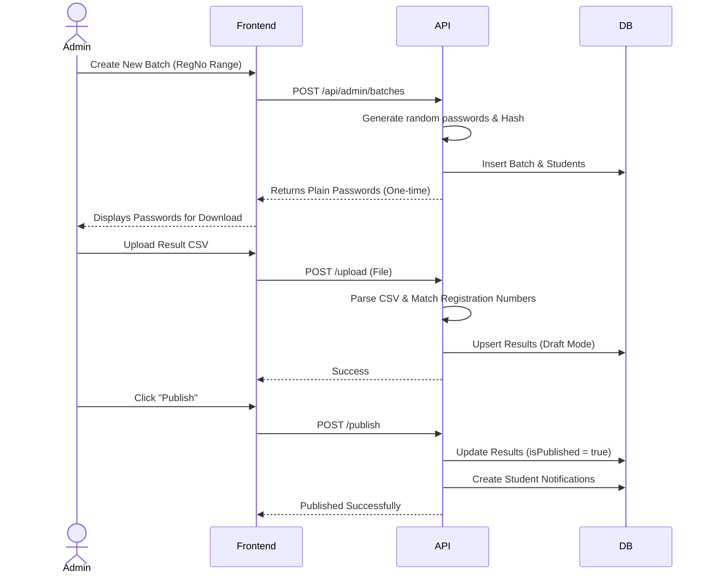
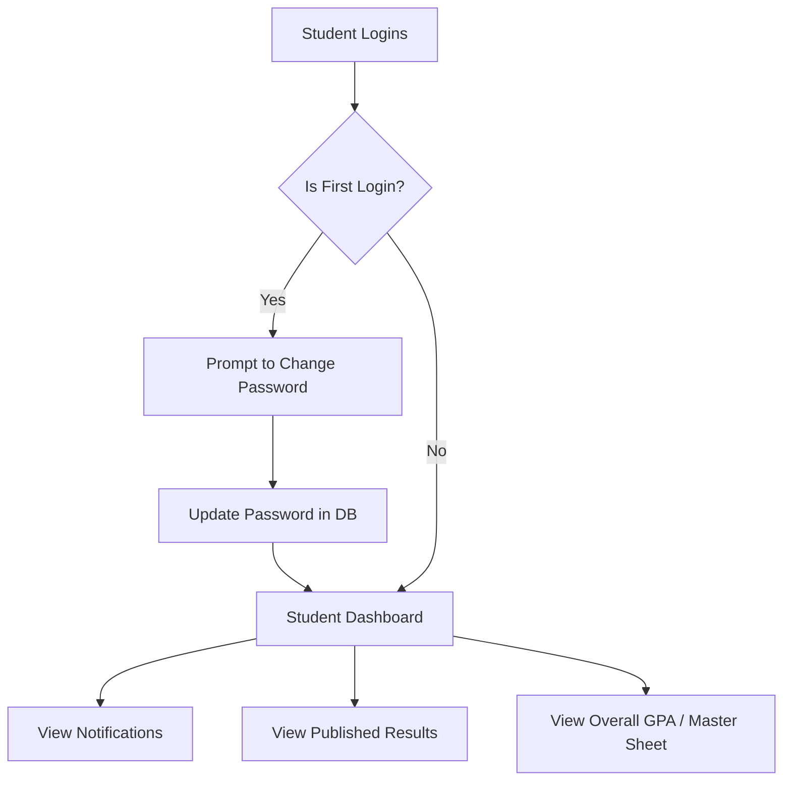

# Result Management System Documentation

## 1. Overview
The **Result Management System** is a full-stack web application designed to streamline the academic result processing lifecycle. It provides secure portals for Administrators/Examiners and Students, allowing bulk registration of students, module management, CSV-based result uploads, automated result processing (GPA calculations), and result publishing with real-time notifications.

---

## 2. Technology Stack & Frameworks

The system is built using modern, high-performance web technologies:

### **Frontend (Admin & Student Portals)**
*   **Framework:** [React 19](https://react.dev/) – Component-based UI library.
*   **Build Tool:** [Vite](https://vitejs.dev/) – Next-generation, blazing-fast frontend tooling.
*   **Styling:** [Tailwind CSS v4](https://tailwindcss.com/) – Utility-first CSS framework for rapid UI development.
*   **UI Components:** [Shadcn/ui](https://ui.shadcn.com/) & [Base UI] – Accessible, customizable UI components.
*   **Routing:** [React Router](https://reactrouter.com/) – Client-side routing.
*   **Network/API:** [Axios](https://axios-http.com/) – Promise-based HTTP client for API requests.
*   **Icons:** Lucide React.

### **Backend (API Server)**
*   **Runtime:** [Node.js](https://nodejs.org/)
*   **Framework:** [Fastify](https://fastify.dev/) – Extremely fast and low-overhead web framework for Node.js (significantly faster than Express).
*   **Authentication:** JWT (JSON Web Tokens) via `@fastify/jwt`.
*   **Security:** Bcrypt (for password hashing).
*   **Data Processing:** `csv-parser` for handling bulk uploads (results, department allocations).

### **Database & ORM**
*   **Database:** [PostgreSQL](https://www.postgresql.org/) (Hosted via Neon Serverless Postgres).
*   **ORM:** [Prisma](https://www.prisma.io/) – Type-safe database client and migration tool.

---

## 3. System Architecture

The application follows a standard Three-Tier Client-Server Architecture.

---

## 4. Database Schema Structure

The core entities are highly relational, allowing complex grade tracking and department-level access control.

---

## 5. User Flows

### A. Admin Flow (Batch & Result Management)
Administrators create batches, allocate students to departments, upload CSV results, and publish them.

### B. Student Flow (Viewing Results)
Students log in to see their specific results, GPA calculations, and notifications.

---

## 6. Key Implementation Details

1.  **Fast Bulk Operations:** Batch creation heavily utilizes optimized password hashing (tuned salt rounds) and Prisma's `createMany` (with `skipDuplicates`) to handle thousands of rows efficiently without blocking the event loop.
2.  **Streaming CSV Parsing:** Results and department allocations are processed using Node.js Streams piping directly into `csv-parser`. This ensures memory efficiency even with very large CSV files.
3.  **GPA Calculation Engine:** The backend dynamically calculates SGPA (Semester Grade Point Average) and CGPA (Cumulative Grade Point Average) by fetching all past results and mapping them to a standardized 4.0 grading scale logic in the Master Sheet API.
4.  **Security:** 
    *   CORS protection.
    *   Passwords are never stored in plain text (Bcrypt).
    *   Stateless JWT authentication requiring Bearer tokens on all protected routes.
